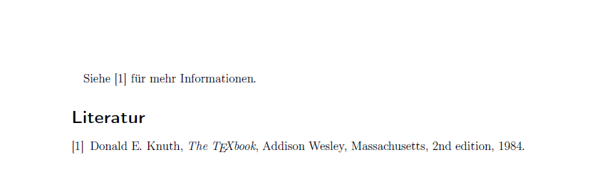

[Letztes Kapitel](Kapitel7.md)

# Kapitel 8: Literaturverzeichnisse

## Allgemeines

Es gibt verschiedene Möglichkeiten, in LaTeX eine Bibliografie zu erstellen.

* mittels **bibliography** Umgebung
* mit **bibtex**
* mit **biber**

Die ``bibliography`` Umgebung lohnt sich dabei nur für kleine Dokumente, in denen nur wenige Literaturverweise vorkommen. **Bibtex** war sehr lange Zeit der Standard, wenn es um die Literaturverwaltung geht. Die Anpassung der Zitierstile war dabei aber sehr mühselig, da bibtex eine eigene, auf Umgekehrter Polnischer Notation basierende, Programmiersprache nutzt.

``Biber`` ist der aktuelle Standard, daher soll in diesem Kapitel der Fokus darauf liegen, vorher betrachten wir jedoch die ``bibliography`` Umgebung:

## Die ``bibliography`` Umgebung

Hat man nur wenige Referenzen, die man eh nicht nochmal irgendwo nutzen möchte, dann reicht oft auch die ``bibliography`` Umgebung.

Als Parameter gibt man die umgefähre Anzahl der Items an, diese Information nutzt TeX dann zur Bestimmung der korrekten Label-Breite. Die einzelnen Einträge werden dann durch ``\bibitem{<key>}`` eingeleitet. Über den ``<key>`` Schlüssel wird der Eintrag identifiziert, jeder Schlüssel darf daher nur einmal in der Bibliografie vorkommen.

**code/document-16.tex**

```latex
\begin{thebibliography}{9}

\bibitem{knuth}
  Donald E. Knuth,
  \textit{The \TeX book},
  Addison Wesley, Massachusetts,
  2nd edition,
  1984.

\end{thebibliography}
```



Im laufenden Text verweist man dann mittels ``\cite{<key>}`` auf die Einträge.

## Literaturverzeichnisse mit ``biblatex`` und ``biber``

Hat man viele Literaturreferenzen oder braucht die Referenzen mehr als einmal, so lohnt es sich, auf ``biblatex`` zu setzen. Der Workflow ist komplizierter, am Ende lohnt es sich aber doch.

Was braucht man:

* Eine ``bib`` Datei mit den Einträgen. Ich persönlich nutze sehr gern Jabref dafür, das für alle Plattformen verfügbar ist. 

Wichtig: Vor der Eingabe der Literatureinträge auf den ``biblatex`` Mode umstellen: ``File > Switch to BibLaTeX Mode``.

In Jabref legt man dann die einzelnen Einträge an und erhält eine Datei im ``bib`` Format:

**code/literatur.bib**

```
% Encoding: UTF-8

@Book{knuth:1984,
  author    = {Donald E. Knuth},
  title     = {The \TeX Book},
  year      = {1984},
  publisher = {Addison-Wesley},
}

@Article{ziegenhagen:2017,
  author       = {Uwe Ziegenhagen},
  title        = {Wie man einen eigenen TeX Live Mirror aufsetzt},
  journal      = {DTK},
  journaltitle = {Die \TeX nische Komödie},
  year         = {2017},
  number       = {2},
}

@Comment{jabref-meta: databaseType:biblatex;}
```

In der TeX-Datei lädt man die notwendigen Pakete:

**code/document-17.tex**

```latex
\documentclass[11pt]{scrartcl}
\usepackage[T1]{fontenc}
\usepackage[utf8]{inputenc}
\usepackage[german]{babel}

\usepackage[style=authortitle-icomp,backend=biber]{biblatex}
\usepackage[babel,german=quotes]{csquotes}

\addbibresource{literatur.bib}

```

und nutzt dann die verschiedenen Zitierbefehle:

**code/document-17.tex**

```latex
\cite{knuth:1984}

\cite{ziegenhagen:2017}

\parencite{knuth:1984}

\footcite[12]{knuth:1984}

\smartcite[12]{knuth:1984}

\citeauthor{knuth:1984}

\citetitle{knuth:1984}

\citeyear{knuth:1984}
```

Die Bibliografie wird dann mittels ``\printbibliography`` ausgegeben. Über geeignete Filter kann man steuern, ob alle Einträge oder beispielsweise nur Bücher oder Artikel ausgegeben werden sollen.

Hinweis: Biblatex listet nur diejenigen Einträge in der Bibliografie 

**code/document-17.tex**

```latex
\printbibliography 

\printbibliography[title={Artikel},type=article]

\printbibliography[title={Bücher},type=book]
```

Um die fertige Bibliografie zu erzeugen, sind dann die folgenden Befehle bzw. Aufrufe notwendig:

* ``pdflatex <NamederDatei>.tex``
* ``biber <NamederDatei>``
* ``pdflatex <NamederDatei>.tex``


Weiter geht es im [nächsten Kapitel](Kapitel9.md) mit Präsentationen in LaTeX.
