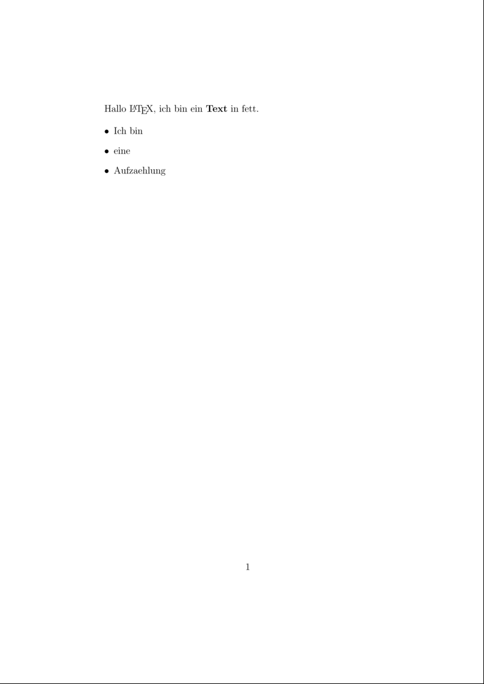

# Inhaltsverzeichnis

* [Kapitel 1: Einleitung und das erste LaTeX-Dokument](README.md)
* [Kapitel 2: Dokumentenklasse und Auswahl der LaTeX-Engine](Kapitel2.md)
* [Kapitel 3: Gliederungsbefehle und Inhaltsverzeichnis](Kapitel3.md)
* [Kapitel 4: Aufzählungen und Textauszeichnung](Kapitel4.md)
* [Kapitel 5: Bilder einbinden](Kapitel5.md)
* [Kapitel 6: Tabellen setzen](Kapitel6.md)
* [Kapitel 7: Mathematik-Satz](Kapitel7.md)
* [Kapitel 8: Literaturverzeichnisse mit ``biblatex``](Kapitel8.md)
* [Kapitel 9: Präsentationen mit dem ``beamer`` Paket](Kapitel9.md)
* [Kapitel 10: Briefe setzen mit ``scrlttr2``](Kapitel10.md)
* Kapitel 11: Zeichnungen in LaTeX erstellen
* [Kapitel 12: Einheitensatz mit ``siunitx``](Kapitel12.md)
* Kapitel 13: Längere Dokumente schreiben

# Kapitel 1: Einleitung

Jedes Jahr halte ich einen oder mehrere Einsteigerkurse für LaTeX. In diesem git-Repository sammle ich Beispiele, die mit steigender Komplexität zeigen sollen, wie man -- zumindest aus meiner Sicht -- am einfachsten mit LaTeX beginnt. 

Dieser Kurs beinhaltet Materialien für einen oder zwei Tage und setzt vor allem auf Standard-LaTeX. Wo es mir sinnvoll erscheint, erwähne ich aber wichtige Zusatzpakete und stelle entsprechende Beispiele bereit.

Fehlermeldungen und Verbesserungsvorschläge werden gern angenommen.

## Der Name

Quelle: "A plain TeX Primer" von Malcolm Clark

* TeX ist abgeleitet von "Tau Epsilon Chi", der ersten Silbe des griechischen Wortes "tèkhne" (über das letzten 'e' kommt noch ein Querstrich), Basis für Wörter wie "Technologie" oder "Technik"
* damals in der Bedeutung von "Kunst" oder "Kunstfertigkeit"
* Aussprache wie "teck" oder "tech" ist richtig, nicht wie in "Latex", dem Baumharz

## Historisches

### TeX
* TeX wurde seit Ende der 1970er vom Stanford-Professor Donald Knuth entwickelt
* Knuth ist bekannt für sein Werk "The Art of Computer Programming" über theoretische Informatik
* 1973 stand die Neu-Auflage der bisher erschienenen Bände an, Satz-Industrie wechselte zu dieser Zeit von Bleisatz auf Fotosatz
* Ergebnisse waren für Knuth nicht gut genug
* ab dem 5. Mai 1977 begann die Entwicklung von TeX

### LaTeX

* TeX ist recht "kompliziert" im Umgang, Knuth selbst nutzte diverse Makros für seine Bücher 
* Leslie Lamport (heute bei Microsoft Research) entwickelte eine Makro-Sammlung, mit denen man TeX leichter bedienen konnte und nannte diese "LaTeX" (gesprochen "La-Tech" oder "Le-Tech", nicht "Latex"). LaTeX ist der gebräuchlichste Weg, um mit TeX zu interagieren. 
* ConTeXt ist eine Alternative zu LaTeX, der Benutzerkreis ist aber deutlich kleiner als bei LaTeX. Hat man Probleme, so findet sich im LaTeX-Umfeld leichter Hilfe.

## Warum sollte ich LaTeX nutzen?

Microsoft Word hat in den letzten Jahren qualitativ zugelegt, auch LibreOffice/OpenOffice sind für viele Anwendungszwecke schon gut benutzbar. In diesen Programmen ist es aber immer noch recht einfach, etwas zu produzieren, was -- nach typografischen und damit ästhetischen Gesichtspunkten -- schlecht aussieht und schwer lesbar ist. LaTeX im Gegensatz dazu macht es dem Nutzer üblicherweise schwer, richtig typografischen Mist zu produzieren.

LaTeX ist auch dazu gemacht, längere Dokumente effizient zu produzieren, wobei man sagen kann: längere Dokumente haben mehr als 50 Seiten. Die Fähigkeiten von LaTeX, Textsatz effizient zu gestalten, helfen einem dann maßgeblich, Zeit zu sparen.

Hier einige Beispiele aus Projekten, an denen ich TeXnisch beteiligt war:

* In einem Dissertationsprojekt sollte ein Werkskatalog angefertigt werden, der dann als PDF per DVD beigelegt werden sollte. Im Werkskatalog wurde in der mehrzeiligen Bildunterschrift auf die Seite der Dissertation verlinkt, in der das Werk besprochen wurde. In der Dissertation wiederum wurde auf die Seite im Werkskatalog verwiesen (verlinkt), auf der das Bild abgebildet war. Alles war dynamisch, bei Anpassungen im Diss-Text bzw. Werkskatalog wurde einfach alles nochmal übersetzt.
* Viele Bilder verwalten: In obigem Werk waren hunderte Bilder inkludiert. Diese manuell in das Dokument einzufügen wäre zeitlich nicht sinnvoll und sehr fehleranfällig gewesen. Also wurden die einzelnen Punkte der Unterschrift in Excel-Spalten nach und nach ergänzt, dann wurde mit Hilfe von Excel-Formeln der `\includegraphics` Befehl für LaTeX zusammengebaut. Alle so erzeugten Befehle wurden dann 1:1 nach LaTeX kopiert.

Ich nehme LaTeX für alle Dokumente, die ordentlich aussehen sollen, auch und insbesondere für Briefe. Dazu aber später in einem eigenen Kapitel mehr.

## Bezug

* Heute gibt es noch zwei TeX-Distributionen, die erwähnenswert sind:
	* MikTeX: nur für Windows
	* TeX Live (mit MacTeX): für alle möglichen Betriebssysteme

Persönlich nutze ich TeX Live, da ich damit _eine_ einheitliche Umgebung für alle meine Rechner bekomme. Der Fokus dieses Kurses liegt daher auch auf TeX Live.

Man erhält TeX Live:

* kostenlos per Download von [www.tug.org/texlive/acquire-netinstall.html](http://www.tug.org/texlive/acquire-netinstall.html)
* auf DVD im Rahmen der Mitgliedschaft bei Dante e.V., der deutschsprachigen Anwendervereinigung TeX, die viele TeX-Aktivitäten fördert
* auf DVD bei Lehmanns Buchhandlung

Für alles weitere nehmen wir an, dass eine LaTeX-Installation erfolgt ist, alternativ kann man auch bei ShareLaTeX oder Overleaf die Beispiele online ausprobieren.

## Editoren

Unter Windows und Mac OS X enthält TeX Live TeXworks, einen aus meiner Sicht sehr guten Editor. Ich nutze ihn zusammen mit in Autohotkey erstellten Tastatur-Shortcuts, mehr dazu in meinem Blog. Man kann aber jeden anderen Editor nehmen, mit speziellen TeX-Editoren ist man aber schneller und es ist ein wenig komfortabler. Die einzig sinnvolle Bedingung ist aber, dass der Editor UTF-8 Unicode unterstützen sollte, da es sonst insbesondere beim Austausch mit anderen nur zu Problemen führt. Die folgende Liste ist nicht vollständig, die Reihenfolge stellt keine Wertung dar:

* TeXworks
* Kile
* Texmaker
* Emacs mit AucTeX
* VIM mit LaTeX-Suite
* Gummi
* Eclipse mit TeXlipse
* TeXniccenter

## Mein erstes Dokument

Nimm den folgenden Code, speichere ihn in einer Datei mit der Endung .tex und übersetze ihn:

* mit dem entsprechenden Übersetzungsbutton im Editor
* auf der Kommandozeile mit dem Befehl `pdflatex <dateiname>.tex`


**code/document-00.tex**

```latex
\documentclass[12pt]{article}

\begin{document}

Hallo \LaTeX, ich bin ein \textbf{Text} in fett.

\begin{itemize}
 \item Ich bin
 \item eine 
 \item Aufzaehlung
\end{itemize}
	
\end{document}
```



Achtung: Wenn dieses Dokument beim Übersetzen Fehler produziert, dann ist was faul. Such jemanden, der LaTeX-Erfahrung hat oder frage nett in einem LaTeX-Forum.
 
Jetzt zur Erklärung, was dieses Dokument macht:

* Die `\documentclass` legt fest, was wir eigentlich schreiben wollen. Jede Dokumentenklasse ist letztlich nichts anderes als eine Vorlage. Und da sich ein kurzer Artikel von fünf Seiten und ein 2000-Seiten-Buch voneinander unterscheiden, gibt es da unterschiedliche.
* [12pt] ist ein optionaler Parameter und legt die Höhe der Grundschrift fest, also dem Fließtext. Alle weiteren Größen, von Überschriften bis zu den Fußnoten, wird von dieser Schriftgröße abgeleitet
* Den Teil vor `\begin{document}` nennt man Präambel. Hier kommen alle Definitionen und ähnliches rein, die das Aussehen unseres Dokuments bestimmen.
* Die Kombination aus `\begin{<irgendwas>}` und `\end{<irgendwas>}` ist dabei eine _Umgebung_, den Begriff werden wir öfter hören.
* `\LaTeX` ist ein _Befehl_, auch dieser Begriff wird öfter fallen.
* Befehle können Parameter haben, wie zum Beispiel der `\textbf{}` Befehl, der den Text in geschweiften Klammern fett druckt.
* die folgenden Zeilen definieren eine _itemize_ Umgebung, eine nicht nummerierte Aufzählung mit Bulletpoints.
* `\end{document}` beendet das Dokument. Alles dahinter wird ignoriert.

So, weiter geht es in der [nächsten Datei](Kapitel2.md) mit Dokumentenklassen und der Auswahl der passenden LaTeX-Engine.
